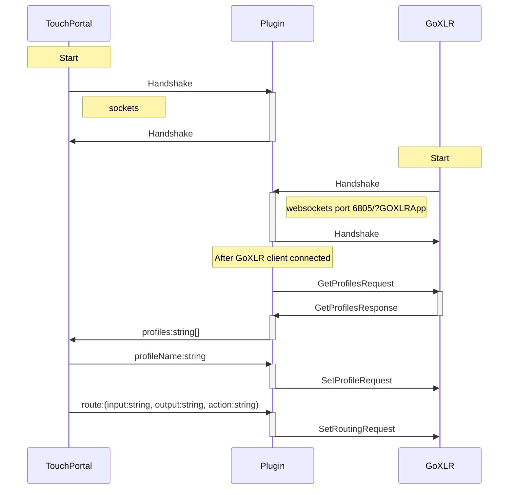

```mermaid
sequenceDiagram
    participant TouchPortal
    participant Plugin
    participant GoXLR

    Note over TouchPortal: Start

    #Handshake
    TouchPortal->>Plugin: Handshake
    activate Plugin
    Note right of TouchPortal: sockets
    Plugin->>TouchPortal: Handshake
    deactivate Plugin

    Note over GoXLR: Start

    #Handshake
    GoXLR->>Plugin: Handshake
    activate Plugin
    Note left of GoXLR: websockets port 6805/?GOXLRApp
    Plugin->>GoXLR: Handshake
    deactivate Plugin

    #Fetch profiles
    Note over Plugin: After GoXLR client connected
    Plugin->>GoXLR: GetProfilesRequest
    activate GoXLR
    GoXLR->>Plugin: GetProfilesResponse
    deactivate GoXLR
    activate Plugin
    Plugin->>TouchPortal: profiles:string[]
    deactivate Plugin

    #Set profiles
    TouchPortal->>Plugin: profileName:string
    activate Plugin
    Plugin->>GoXLR: SetProfileRequest
    deactivate Plugin

    #Set routing
    TouchPortal->>Plugin: route:(input:string, output:string, action:string)
    activate Plugin
    Plugin->>GoXLR: SetRoutingRequest
    deactivate Plugin

    #https://mermaid-js.github.io/mermaid/#/
```
